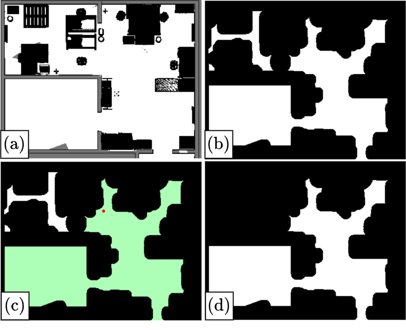

# base_optimization

A ROS package for **sequential mobile-robot base pose optimization** in environments with static and dynamic 3-D obstacles. Given a set of desired end-effector (EE) target poses, the package computes a sequence of navigable base poses from which the targets are reachable, then autonomously navigates the robot and executes arm motions—re-optimizing on the fly when dynamic obstacles block the path.

  

## How It Works

1. **EE target poses** are published on the `/gripper_poses` topic.
2. **`find_opt_pose_multi.py`** builds a 2-D free-space map (inflated by the robot footprint), retrieves the 3-D obstacle cloud from the OctoMap, and solves the optimization problem defined in **`problem_formulation_collision_multi.py`** (exploiting the PSO algorithm) to find collision-free base poses that maximize the number of reachable targets.
3. **`move_to_next_pose.py`** navigates the robot to each base pose via `move_base`, while monitoring the environment checking for dynamic obstacles through the onboard camera frustum, and executes arm motions with MoveIt. If a dynamic obstacle blocks the target, the reactive behaviour is triggered. Re-optimization is triggered automatically in case of a static obstacle, otherwise the cancelled base pose is re-queued at the end of the base sequence.

## Usage

Publish a `geometry_msgs/PoseArray` on the `/gripper_poses` topic with the desired EE targets. The optimizer and navigator nodes handle everything from there:

1. `find_opt_pose_multi` solves for optimal base poses and publishes them on `/locobot/add_opt_base_pose`.
2. `move_to_next_pose` picks up each pose, drives the base, and plans arm motions to reach the associated EE targets.
3. During navigation, dynamic obstacles are detected within the camera frustum. Mobile obstacles cause the target to be re-queued; static obstacles trigger a full re-optimization.

